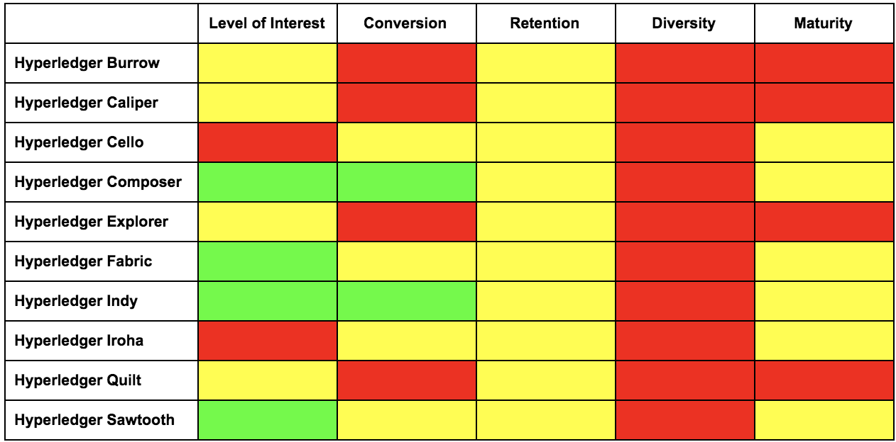

# Introduction

As a start to gathering metrics for Hyperledger, we want a tool that will allow us to generate health assessment reports for each project within Hyperledger, as well as other projects that might be of interest. The reports will look at the following factors and score them on a RYG (Red-Yellow-Green) scale:

* Level of Interest - demonstrates that people are interested in what we are doing and want to get involved

* Conversion - demonstrates that people who are interested in getting involved are able to progress to the point of making an actual contribution

* Retention - demonstrates that people who make one contribution are able to stay involved over time

* Diversity - demonstrates that work is being done by a diverse set of individuals and organizations

* Maturity - demonstrates how established a community is

In addition to the report per project, we would also like a summary report that shows the RYG state for the above factors for each of the projects. [Figure 1](#figure1) shows an example version of such a report (the RYG is randomized for illustration purposes).

We expect that over time the metrics that we will report on will continue to grow. As such, we may grow beyond just project reporting to a metrics portal that can be used to slice and dice the data in other ways (for example by providing a report for a Working Group or for the activities of specific Members). A metrics portal is not in the initial statement of work, but should be considered while developing the tool so that it is easy to make changes in the way the data is presented.

Also, it should be noted that the initial metrics are mostly based on source contributions. We will eventually want to gather metrics related to participation via our other tools -- mailing lists, chat, issue tracking, and wiki, for example.

<a id="figure1">Figure 1: Example of summary report</a> [1](#tablefootnote1)

<a id="tablefootnote1">1RYG for illustration purposes only and not reflective of project health

# Initial Metrics to Gather

## Level of Interest

The metrics surrounding level of interest demonstrate that people are interested in what we are doing and want to get involved. Initially, we will focus on how many people have expressed an interest in contributing.

* Monthly unique page views of Project’s Contributing Guide

## Conversion

The metrics surrounding level of interest demonstrate that people who are interested in getting involved are able to progress to the point of making an actual contribution. Initially, we will focus on showing how many people are able to make a contribution.

* Number of new contributors in last month

* Number of current active contributors (defined as people who have contributed within last 6 months)

* Total number of contributors to the project over the life of the project

* Conversion rate (new contributors / number of unique page views for contributing guide over last month)

## Retention

The metrics surrounding level of interest demonstrate that people who make one contribution are able to stay involved over time.

* Number of people who have become inactive (defined as people who made their last contribution over 6 months ago) in last month

* Retention rate (defined as number active contributors divided by the total number of contributors)

* Level of engagement (defined as the number of repeat contributors divided by the total number of contributors)

## Diversity

The metrics surrounding diversity demonstrate that work is being done by a diverse set of individuals and organizations.

* Individual contribution diversity - are the majority of code contributions coming from a small set of individuals? Quarterly counts of contributors who are core, regular, and casual, where the classification is built by sorting contributors by their total number of commits and the total commits per project:

    * Core contributors - the individuals whose commits sum up to 80% of the total number of commits in the quarter.

    * Regular contributors - the individuals whose commits sum up to 95% of the total number of commits in the quarter.

    * Casual contributors - The individuals who are neither core nor regular committers

* Organizational diversity -- are contributions coming from multiple organizations and how is participation spread across organizations?

* Time zone diversity - are contributions coming from a single geographic region and how is participation in project calls spread across time zones?

## Maturity

The metrics surrounding maturity demonstrate how established a community is.

* A measure combining the above elements. For more mature projects, the level of interest is high, it is easy to begin contributing to the project, and the diversity is wide.

# Requirements

1. The tool must be developed as an open source tool that conforms to the intellectual property policies of the [Hyperledger Charter](https://hyperledger.org/about/charter).

2. The tool must allow new projects and their associated repositories to be added via a configuration file.

3. The tool must be able to run on an adhoc basis.

4. It must be possible for contributors who contribute under multiple aliases to link those aliases to a single entity.

5. It must be possible for contributors to specify the organization that they work for.

6. The organization specification should allow for individuals who move organizations to specify the timeframe for which they worked for a particular organization.

7. The report must contain the date that it was generated.

8. The report must contain a list of contributors who became inactive in the last month (i.e., this would be people whose last contribution was between 6 and 7 months).

9. Threshold values (as defined below) must be configurable.

10. If applicable, the report should include the date the project was accepted into incubation and the date graduated to active state.

# Determining RYG for the Factors

## Level of Interest

The RYG for the level of interest factor will look at the Monthly unique page views of contributing guide and use the following ranges:

<table>
  <tr>
    <td><400</td>
    <td>Red</td>
  </tr>
  <tr>
    <td>401-800</td>
    <td>Yellow</td>
  </tr>
  <tr>
    <td>>800</td>
    <td>Green</td>
  </tr>
</table>

## Conversion

The RYG for conversion factor will be based on the conversion rate calculation.

<table>
  <tr>
    <td><34%</td>
    <td>Red</td>
  </tr>
  <tr>
    <td>34-66%</td>
    <td>Yellow</td>
  </tr>
  <tr>
    <td>>66%</td>
    <td>Green</td>
  </tr>
</table>

## Retention

The RYG for the retention factor should look at both the retention rate and the level of engagement. First we will calculate the RYG for each metric based on the 33:34:33 model.

<table>
  <tr>
    <td><34%</td>
    <td>Red</td>
  </tr>
  <tr>
    <td>34-66%</td>
    <td>Yellow</td>
  </tr>
  <tr>
    <td>>66%</td>
    <td>Green</td>
  </tr>
</table>

Then we need to combine these two to come up with the final RYG value. We will use the following matrix to decide:

<table>
  <tr>
    <td>Retention Rate</td>
    <td>Level of Engagement</td>
    <td>Final RYG</td>
  </tr>
  <tr>
    <td>Red</td>
    <td>Red</td>
    <td>Red</td>
  </tr>
  <tr>
    <td>Red</td>
    <td>Yellow</td>
    <td>Red</td>
  </tr>
  <tr>
    <td>Yellow</td>
    <td>Red</td>
    <td>Red</td>
  </tr>
  <tr>
    <td>Red</td>
    <td>Green</td>
    <td>Yellow</td>
  </tr>
  <tr>
    <td>Green</td>
    <td>Red</td>
    <td>Yellow</td>
  </tr>
  <tr>
    <td>Yellow</td>
    <td>Yellow</td>
    <td>Yellow</td>
  </tr>
  <tr>
    <td>Yellow</td>
    <td>Green</td>
    <td>Yellow</td>
  </tr>
  <tr>
    <td>Green</td>
    <td>Yellow</td>
    <td>Yellow</td>
  </tr>
  <tr>
    <td>Green</td>
    <td>Green</td>
    <td>Green</td>
  </tr>
</table>

## Diversity

When looking at the diversity factor, Hyperledger is first and foremost interested in the organizational diversity of our projects. As such, the initial RYG will look at the percentage of contributions that come from a single organization.

<table>
  <tr>
    <td>>=50%</td>
    <td>Red</td>
  </tr>
  <tr>
    <td>>=25% </td>
    <td>Yellow</td>
  </tr>
  <tr>
    <td><25%</td>
    <td>Green</td>
  </tr>
</table>

## Maturity

When looking at the maturity factor, the RYG should be a combination of the following: the level of interest is high, it is easy to begin contributing to the project (i.e., the conversion rate is high), and the diversity is wide.

# References

* [[Hyperledger Project TSC] Measuring the health, strength, and diversity of Hyperledger projects by Tracy Kuhrt](https://lists.hyperledger.org/g/tsc/message/867?p=,,,20,0,0,0::Created,,metrics,20,2,0,17552062)

* [OPNFV Quarterly Reports](https://wiki.opnfv.org/display/DEV/Quarterly+Reports)

* [Project Reports Source Code - Initial version](https://github.com/tkuhrt/hyperledger-community/tree/master/project-reports)
